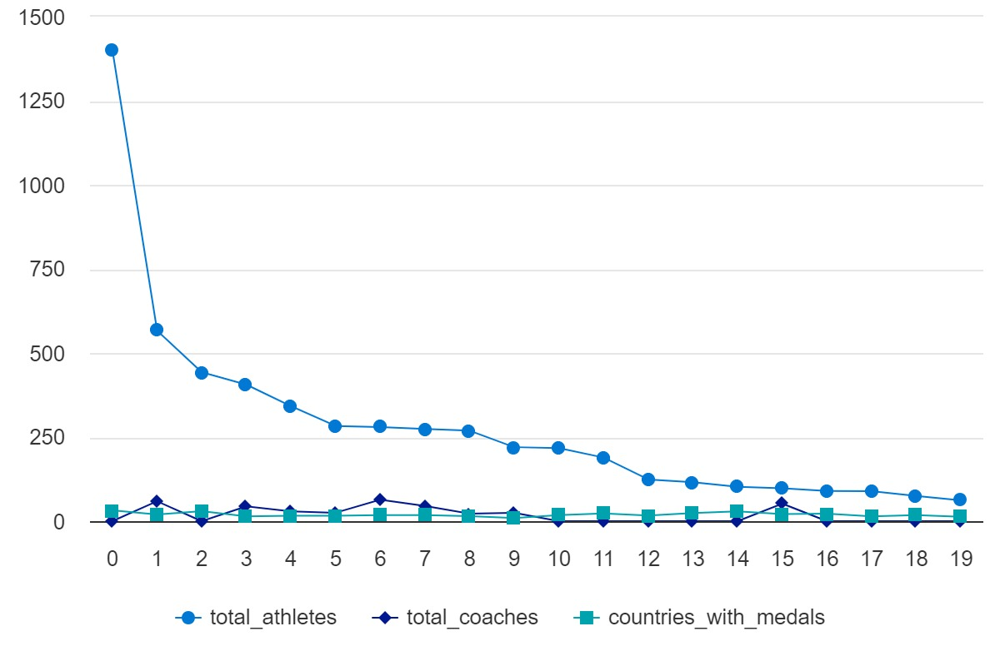

# Olympic-End-to-End-Data-Engineering

---

## Table of Contents
1. [Dataset](#dataset)  
2. [Azure Services Used](#azure-services-used)  
3. [ETL Process](#etl-process)  
4. [Future Enhancements](#future-enhancements)

---

## Dataset

The **2021 Olympics** dataset comprises five CSV files:

- **Athletes** – Details of participating athletes.  
- **Coaches** – Information on coaches linked to different events and teams.  
- **EntriesGender** – Breakdown of athletes based on gender.  
- **Medals** – Records of medal recipients, categorized by event and country.  
- **Teams** – Background details of participating teams.

---

## Azure Services Used

1. **Azure Data Factory (ADF)**  
   - Cloud-based service for creating and scheduling ETL pipelines.  
   - Pipelines move raw data from GitHub to Azure Data Lake Storage Gen2.

2. **Azure Data Lake Storage Gen2 (ADLS Gen2)**  
   - Central repository for both raw and refined data.  
   - Organized into two main folders:  
     - **RawData**: Stores raw files directly ingested from the source.  
     - **TransformedData**: Holds cleaned, processed datasets.

3. **Azure Databricks**  
   - An Apache Spark–based platform for large-scale data analytics and transformations.  
   - Key tasks include:  
     - Schema validation  
     - Data cleaning and missing value handling  
     - Writing the refined data back to ADLS Gen2

4. **Azure Synapse Analytics**  
   - Data warehousing service for querying transformed data.  
   - Processed data is imported into a SQL pool for high-performance analysis.

5. **Power BI**  
   - Business intelligence tool for creating data visualizations and reports.  
   - Will be integrated with Synapse Analytics to build interactive dashboards (currently in progress).

---

## ETL Process

1. **Data Ingestion**  
   - **Azure Data Factory** copies raw CSV files from GitHub to the `RawData` folder in ADLS Gen2.

2. **Data Transformation**  
   - **Azure Databricks** (via PySpark) reads the raw files, validates schemas, and handles missing data.  
   - Transformed datasets are then written to the `TransformedData` folder in ADLS Gen2.

3. **Data Warehousing**  
   - The cleaned, structured data is exported to **Azure Synapse Analytics**.  
   - Tables are created in a Synapse SQL pool to enable efficient querying and analysis.

4. **Visualization** 

## Visualization Coach-to-Athlete Ratios per countries with medals

---

> **Note**: Please ensure that any .show() is removed in production to reduce overhead and improve execution speed. 
